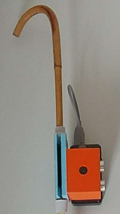
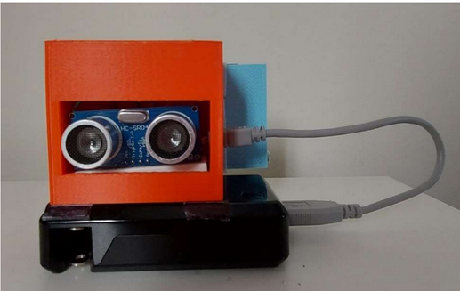

# Ultrasonic-Cane-Attachment

## Project 4

The Ultrasonic Cane Attachment Device (U.C.A.D) was our P4 Project, aiming to assist user's navigation by attaching to their cane. It uses ultrasonic sensors to detect nearby objects, signaled by an audible buzzer with varying pitch. The 3D-printed shell holds its components and a Velcro hinge allows easy attachment. Recharging is done by plugging into a wall outlet overnight.

Here is a video link to the device in use.
https://www.youtube.com/watch?v=AGfCc6Z_69Q

## Images

